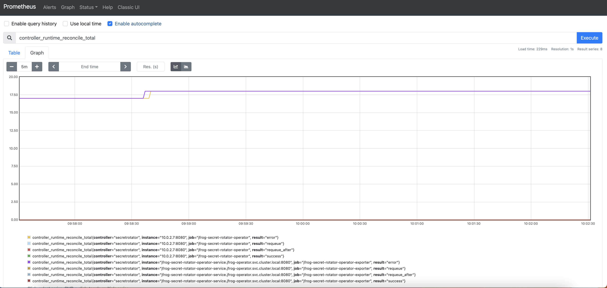

# JFrog Secret Rotator Operator Monitoring

## To setup monitoring

### Step 1. Install operator. You can skip it if JFrog Registry Operator is already installed
Follow [operator installation docs](../../README.md).

### Step 2. Install Monitoring Components
#### Install operator service
```shell
kubectl apply -f operator-service.yaml -n ${NAMESPACE}
```
#### Install Prometheus
```shell
kubectl apply -f prometheus -n ${NAMESPACE}
```
#### To test locally
```shell
kubectl port-forward svc/prometheus-k8s 9090:9090 -n ${NAMESPACE}
```
And open http://localhost:9090

Example: We can add sample query `controller_runtime_reconcile_total` and check graph

